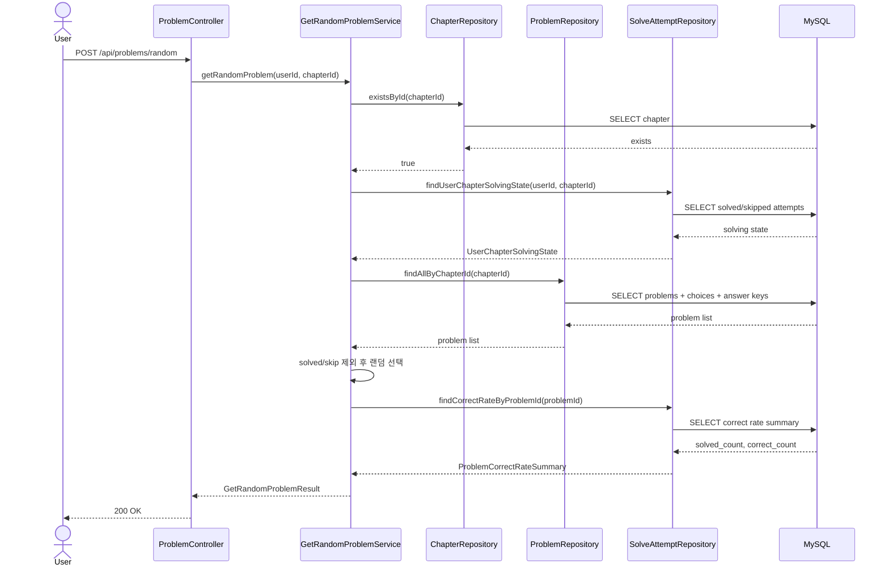
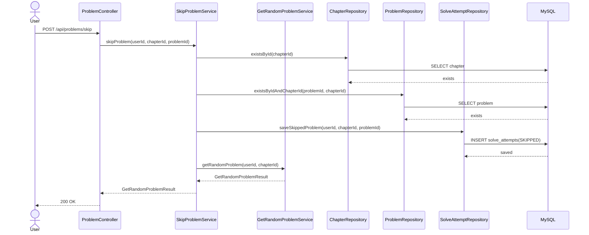
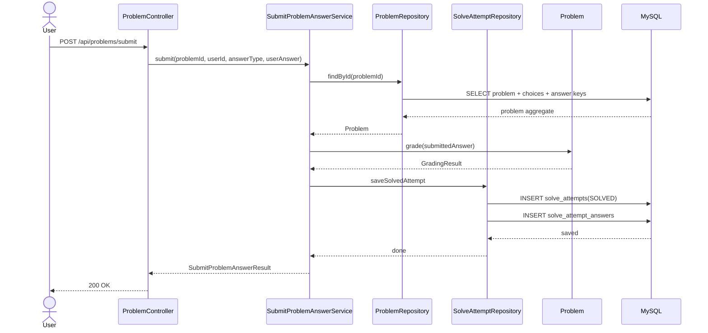
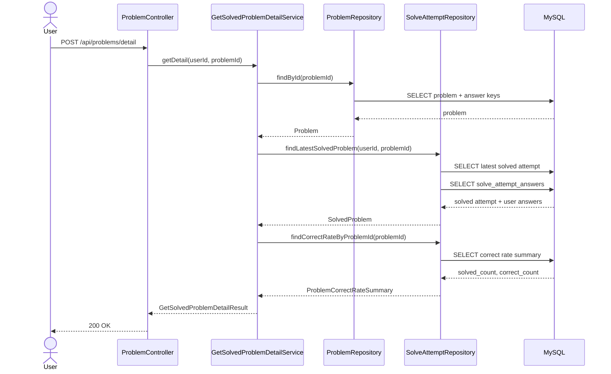

# teamsky

학습 플랫폼의 핵심 기능인 `단원별 문제 풀이`를 중심으로 구현한 Spring Boot 3.3 / Java 21 멀티 모듈 프로젝트입니다.

현재 문서 기준 구현 범위는 아래 네 API입니다.

- 랜덤 문제 조회
- 문제 넘기기
- 문제 제출
- 풀었던 문제 상세 조회

## 1. 프로젝트 목표

이 프로젝트는 단순 CRUD보다 아래 관점을 더 중요하게 두고 구현했습니다.

- 도메인 규칙을 계층 밖으로 새지 않게 유지
- 멀티 모듈 구조로 책임을 명확히 분리
- 테스트 가능한 구조 유지
- 조회 성능을 고려한 설계
- Docker Compose로 애플리케이션과 인프라를 한 번에 실행 가능하게 구성

## 2. 멀티 모듈 구조

```text
root
├── quiz-bootstrap
├── quiz-api
├── quiz-application
├── quiz-domain
└── quiz-infrastructure
```

### `quiz-bootstrap`

실행 모듈입니다.

- `@SpringBootApplication`
- 실제 애플리케이션 조립
- 테스트 시 end-to-end 검증 진입점

### `quiz-api`

HTTP 입출력 계층입니다.

- controller
- request/response DTO
- validation
- Swagger 문서화
- exception -> HTTP 응답 변환

### `quiz-application`

유스케이스 계층입니다.

- service
- command/result model
- repository interface
- transaction boundary

### `quiz-domain`

순수 도메인 모델 계층입니다.

- 문제
- 선택지
- 사용자-단원 풀이 상태
- 정답률 정책

### `quiz-infrastructure`

영속성 및 외부 기술 구현 계층입니다.

- JPA entity
- Spring Data JPA repository
- application repository 구현체

## 3. 왜 이렇게 나눴는가

이 과제는 멀티 모듈과 DDD 원칙을 요구합니다. 따라서 실행, API, 유스케이스, 도메인, 영속성을 같은 모듈에 섞지 않고 분리했습니다.

이 구조의 장점은 아래와 같습니다.

- API 요구사항 변경이 도메인 모델에 직접 영향을 덜 줍니다.
- 도메인 규칙을 Spring MVC/JPA 없이 단위 테스트할 수 있습니다.
- 조회 성능 최적화가 필요할 때 `quiz-infrastructure`에서 집중적으로 개선할 수 있습니다.
- `quiz-bootstrap`에서만 실행과 조립을 담당하므로 배포 단위가 명확합니다.

## 4. DDD 관점 정리

### Ubiquitous Language

이 프로젝트에서는 아래 용어를 공통 언어로 정했습니다.

- `Chapter`: 문제를 묶는 단원
- `Problem`: 사용자가 푸는 문제
- `Choice`: 객관식 선택지
- `SolveAttempt`: 사용자의 풀이 또는 건너뛰기 기록
- `SkippedProblem`: 사용자가 직전에 넘긴 문제
- `CorrectRate`: 문제 정답률
- `UserChapterSolvingState`: 특정 사용자-특정 단원 기준 풀이 상태

### Bounded Context

현재 기능 기준으로 도메인을 크게 세 개의 문맥으로 해석했습니다.

- `problem`
  - 문제와 선택지 자체
- `solving`
  - 사용자의 풀이 상태, 문제 넘기기, 출제 가능 여부
- `statistics`
  - 정답률 공개 정책

프로젝트 규모상 별도 모듈로 더 쪼개지는 않았고, `quiz-domain` 내부 패키지로 경계를 표현했습니다.

### Aggregate Root 관점

현재 구현에서 핵심적으로 본 aggregate root 성격의 모델은 아래입니다.

- `Problem`
- `UserChapterSolvingState`

특히 이 요구사항의 핵심 규칙은 `Chapter` 단독보다 `사용자 + chapter + 직전 skip + 이미 푼 문제` 조합에 가깝기 때문에, `UserChapterSolvingState`를 중요한 도메인 모델로 해석했습니다.

## 5. API

## 5.1 랜덤 문제 조회

- `POST /api/problems/random`

요청

```json
{
  "chapterId": 1,
  "userId": 1
}
```

응답 예시

```json
{
  "problemId": 1001,
  "content": "Java에서 기본형 중 정수 타입이 아닌 것을 고르세요.",
  "choices": ["int", "long", "boolean", "short", "byte"],
  "answerCorrectRate": 68
}
```

동작 규칙

- 이미 푼 문제 제외
- 직전에 skip한 문제 제외
- 남은 문제 중 랜덤 1개 반환
- 30명 이상 풀이 시 정답률 공개
- 30명 미만이면 `answerCorrectRate = null`

오류 응답

- `400`: 요청 검증 실패
- `404`: 존재하지 않는 chapter
- `409`: 더 이상 출제 가능한 문제 없음

시퀀스 다이어그램



## 5.2 문제 넘기기

- `POST /api/problems/skip`

요청

```json
{
  "chapterId": 1,
  "userId": 1,
  "problemId": 1001
}
```

응답

- 현재 문제를 `SKIPPED`로 기록한 뒤
- 같은 단원에서 다음 랜덤 문제 1개를 바로 반환

오류 응답

- `400`: 요청 검증 실패
- `404`: 존재하지 않는 chapter 또는 해당 chapter에 속하지 않는 problem
- `409`: skip 이후 더 이상 출제 가능한 문제 없음

시퀀스 다이어그램



## 5.3 문제 제출

- `POST /api/problems/submit`

요청

```json
{
  "problemId": 3,
  "userId": 1,
  "answerType": "OBJECTIVE",
  "selectedChoices": [1, 3]
}
```

응답 예시

```json
{
  "problemId": 3,
  "answerType": "OBJECTIVE",
  "answerStatus": "PARTIAL",
  "explanation": "정답은 1번과 2번입니다.",
  "problemAnswers": ["1", "2"]
}
```

동작 규칙

- 객관식/주관식 모두 지원
- 객관식은 복수 정답 가능
- 정답/부분 정답/오답 판정
- 제출 즉시 해설과 정답 반환
- 제출 이력과 사용자 답안 저장

오류 응답

- `400`: 요청 검증 실패
- `404`: 존재하지 않는 problem
- `409`: 문제 답안 형식과 제출 형식 불일치

시퀀스 다이어그램



## 5.4 풀었던 문제 상세 조회

- `POST /api/problems/detail`

요청

```json
{
  "userId": 1,
  "problemId": 3
}
```

응답 예시

```json
{
  "problemId": 3,
  "answerType": "OBJECTIVE",
  "answerStatus": "PARTIAL",
  "explanation": "정답은 1번과 2번입니다.",
  "problemAnswers": ["1", "2"],
  "userAnswers": ["1", "3"],
  "answerCorrectRate": 67
}
```

동작 규칙

- 사용자 + 문제 기준 최신 `SOLVED` 이력을 조회
- 정답, 사용자 답안, 해설, 정답률을 함께 반환
- 풀이 이력이 없으면 예외 처리

오류 응답

- `400`: 요청 검증 실패
- `404`: 존재하지 않는 problem 또는 풀이 이력 없음

시퀀스 다이어그램



## 6. 현재 구현된 핵심 규칙

- 직전 skip 문제는 다음 랜덤 추출 대상에서 제외
- solved 상태 문제는 랜덤 후보에서 제외
- 최신 `SOLVED` 이력 기준으로 상세 조회
- 문제 제출 시 사용자 답안 별도 저장
- 문제 정답률은 `solve_attempts` 집계를 통해 계산
- 정답률 공개 규칙은 `ProblemCorrectRatePolicy`가 담당

## 7. JPA 설계 관점

현재 JPA entity는 객체 연관관계를 최소화하고 FK id 기반으로 설계했습니다.

예를 들면:

- `ProblemJpaEntity`는 `ChapterJpaEntity`를 직접 참조하지 않고 `chapterId`만 가집니다.
- `ProblemChoiceJpaEntity`도 `ProblemJpaEntity` 객체를 잡지 않고 `problemId`만 가집니다.

이렇게 한 이유는 아래와 같습니다.

- JPA 프록시와 지연 로딩 의존 최소화
- aggregate 경계 명확화
- 조회 쿼리 의도를 더 명시적으로 표현
- `quiz-domain`과 `quiz-infrastructure` 분리 유지

DB 레벨 FK 제약은 유지하지만, JPA 객체 그래프는 남용하지 않는 방향을 선택했습니다.

## 8. 현재 동작하는 쿼리와 성능 관점

현재 랜덤 문제 조회는 아래 순서로 동작합니다.

1. chapter 존재 여부 확인
2. chapter의 문제 목록 조회
3. 문제 id 목록으로 선택지 일괄 조회
4. 사용자 solved 문제 목록 조회
5. 사용자의 마지막 skipped 문제 조회
6. 특정 문제의 정답률 집계 조회

현재 구조의 장점은 아래와 같습니다.

- `Problem -> Choice`를 join fetch로 크게 끌고 오지 않고 명시 조회 후 조합합니다.
- solved 문제 목록과 마지막 skipped 문제 조회가 분리되어 있어 의도가 명확합니다.
- 정답률 집계는 `solve_attempts`에서 count/sum 집계로 처리합니다.

현재 한계도 있습니다.

- 랜덤 선택 전 chapter 내 문제를 모두 메모리로 가져와 필터링합니다.
- 문제 수가 매우 많아지면 이 부분은 더 최적화가 필요합니다.
- 지금은 과제 범위에 맞춰 읽기 쉬운 구조를 우선했습니다.

향후 개선 여지는 아래와 같습니다.

- DB에서 후보 문제를 더 직접적으로 줄이는 쿼리
- `solve_attempts(user_id, chapter_id, status)` 인덱스 최적화
- 정답률 집계 캐시 또는 별도 통계 테이블

즉 현재 성능은 "과제 구현 단계에서는 합리적"이지만, 대규모 데이터 기준 최적화가 끝난 상태는 아닙니다.

## 9. 테스트 전략

현재 테스트는 계층별로 나눴습니다.

- application unit test
  - `GetRandomProblemServiceTest`
  - `SkipProblemServiceTest`
  - `SubmitProblemAnswerServiceTest`
  - `GetSolvedProblemDetailServiceTest`
- api slice test
  - `@WebMvcTest` 기반 `ProblemControllerTest`
- infrastructure integration test
  - `SolvingRepositoryIntegrationTest`
- bootstrap end-to-end test
  - `GetRandomProblemEndToEndTest`

이 구조로 인해 규칙, HTTP 계약, JPA 매핑, 실제 계층 연결을 각각 분리해서 검증할 수 있습니다.

## 10. Docker Compose 실행

### 실행

```bash
docker compose up --build
```

실행 구성

- `app`: Spring Boot 애플리케이션
- `mysql`: 메인 DB
- `redis`: 이후 사용자 시도 횟수/캐시 계층 확장용

### 시드 데이터

MySQL 컨테이너는 아래 디렉터리의 SQL을 초기화 시 실행합니다.

- `docker/mysql/init/01-schema-and-seed.sql`

이 SQL은 아래를 수행합니다.

- 테이블 생성
- 예제 chapter/problem/problem_choices/solve_attempts 삽입

중요한 점:

- 이 init SQL은 MySQL 볼륨이 처음 만들어질 때만 실행됩니다.
- 이미 기존 볼륨이 있으면 새 데이터가 반영되지 않습니다.

초기 데이터를 다시 넣으려면:

```bash
docker compose down -v
docker compose up --build
```

## 11. 로컬 실행

```bash
./gradlew :quiz-bootstrap:bootRun
```

Swagger:

- `http://localhost:8080/swagger-ui.html`

헬스 체크:

- `http://localhost:8080/api/health`
- `http://localhost:8080/actuator/health`

## 12. 주요 테스트 명령

```bash
./gradlew :quiz-application:test
./gradlew :quiz-api:test
./gradlew :quiz-infrastructure:test
./gradlew :quiz-bootstrap:test
```

## 13. 현재 범위와 남은 작업

현재 구현 범위:

- 랜덤 문제 조회
- 문제 넘기기
- Swagger 문서화
- Docker Compose 기반 실행
- 계층별 테스트
