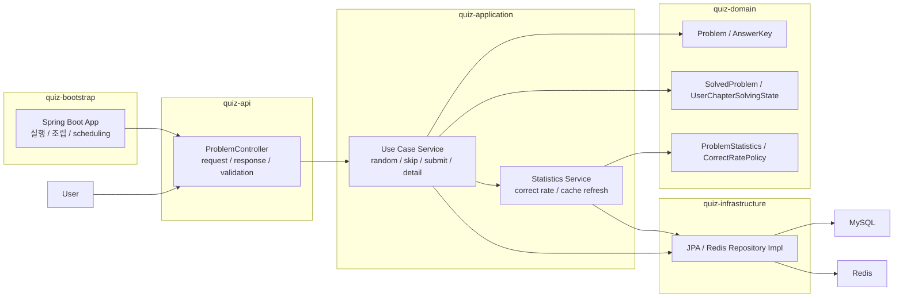

# 아키텍처 개요

## 프로젝트 목표

이 프로젝트는 단순 CRUD보다 아래 관점을 우선해 구현했습니다.

- 도메인 규칙을 계층 밖으로 새지 않게 유지
- 멀티 모듈 구조로 책임을 명확히 분리
- 테스트 가능한 구조 유지
- 조회 성능과 정답률 계산 책임 분리
- Docker Compose로 애플리케이션과 인프라를 한 번에 실행 가능하게 구성

## 멀티 모듈 구조

```text
root
├── quiz-bootstrap
├── quiz-api
├── quiz-application
├── quiz-domain
└── quiz-infrastructure
```



### `quiz-bootstrap`

- `@SpringBootApplication`
- 실제 애플리케이션 조립
- scheduling 활성화
- end-to-end 테스트 진입점

### `quiz-api`

- controller
- request/response DTO
- validation
- Swagger 문서화
- exception -> HTTP 응답 변환

### `quiz-application`

- service
- command/result model
- repository interface
- transaction boundary

### `quiz-domain`

- 문제
- 선택지
- 사용자 풀이 상태
- 정답률 정책

### `quiz-infrastructure`

- JPA entity
- Spring Data JPA repository
- Redis cache 구현
- application repository 구현체

## 왜 이렇게 나눴는가

이 과제는 멀티 모듈과 DDD 원칙을 요구합니다. 따라서 실행, API, 유스케이스, 도메인, 영속성을 같은 모듈에 섞지 않고 분리했습니다.

이 구조의 장점은 아래와 같습니다.

- API 요구사항 변경이 도메인 모델에 직접 영향을 덜 줍니다.
- 도메인 규칙을 Spring MVC/JPA 없이 단위 테스트할 수 있습니다.
- 조회 성능 최적화가 필요할 때 `quiz-infrastructure`에서 집중적으로 개선할 수 있습니다.
- `quiz-bootstrap`에서만 실행과 조립을 담당하므로 배포 단위가 명확합니다.

## 현재 구현 범위

- 랜덤 문제 조회
- 문제 넘기기
- 문제 제출
- 풀었던 문제 상세 조회
