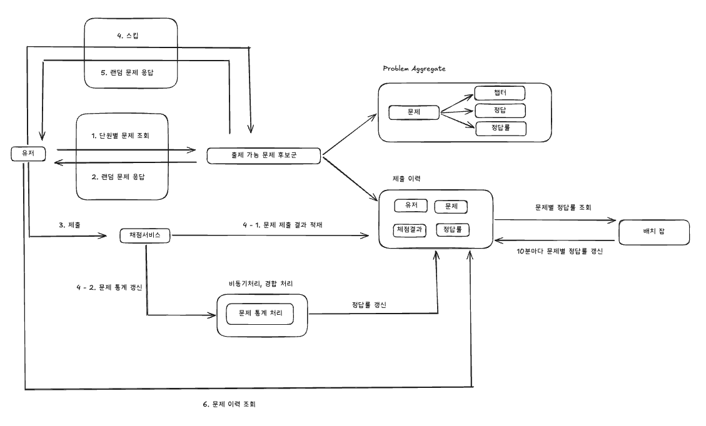

# 도메인 설계

## DDD 학습과 적용

이번 과제에서는 DDD를 학습하면서 아래 기준을 의식해 구조를 정리했습니다.

- 공통 언어를 먼저 정리하고 코드 이름에 반영할 것
- 문제, 풀이, 통계라는 문맥을 구분할 것
- 비즈니스 규칙은 controller나 JPA entity보다 domain/application에서 읽히게 할 것

그 결과 현재 구조는 `Problem`, `UserChapterSolvingState`, `SolvedProblem`, `ProblemCorrectRatePolicy`처럼
도메인 개념이 직접 드러나는 방향으로 정리했습니다.

## Ubiquitous Language

- `Chapter`: 문제를 묶는 단원
- `Problem`: 사용자가 푸는 문제
- `Choice`: 객관식 선택지
- `SolveAttempt`: 사용자의 풀이 또는 건너뛰기 기록
- `SkippedProblem`: 사용자가 직전에 넘긴 문제
- `CorrectRate`: 문제 정답률
- `UserChapterSolvingState`: 특정 사용자-특정 단원 기준 풀이 상태

## Bounded Context

- `problem`
  - 문제와 선택지 자체
- `solving`
  - 사용자의 풀이 상태, 문제 넘기기, 출제 가능 여부
- `statistics`
  - 정답률 공개 정책과 집계 스냅샷

프로젝트 규모상 별도 모듈로 더 쪼개지는 않았고, `quiz-domain` 내부 패키지로 경계를 표현했습니다.

## Aggregate Root 관점

현재 구현에서 핵심적으로 본 aggregate root 성격의 모델은 아래입니다.

- `Problem`
- `UserChapterSolvingState`

특히 요구사항의 핵심 규칙은 `사용자 + chapter + 직전 skip + 이미 푼 문제` 조합에 가깝기 때문에,
`UserChapterSolvingState`를 중요한 도메인 모델로 해석했습니다.

## 현재 구현된 핵심 규칙

- 직전 skip 문제는 다음 랜덤 추출 대상에서 제외
- solved 상태 문제는 랜덤 후보에서 제외
- 최신 `SOLVED` 이력 기준으로 상세 조회
- 문제 제출 시 사용자 답안 별도 저장
- 문제 제출 시 `problem_user_statistics`, `problem_statistics`를 갱신
- 정답률 조회는 Redis 캐시 우선, DB fallback 구조
- 정답률 공개 규칙은 `ProblemCorrectRatePolicy`가 담당

## 주관식 답변에 LLM을 활용할 수 있다면

현재 구현은 주관식 답안을 정규화한 문자열 일치 기준으로 처리합니다. 실제 서비스라면 단순 문자열 일치만으로는 정답 인정 범위가 너무 좁을 수 있다고 보았습니다.

확장 기준은 아래와 같습니다.

- 정답의 공식 답변과 허용 가능한 유의어를 먼저 정의
- LLM은 자유 생성보다 "정답 의미와 일치하는지 분류" 역할로 제한
- 결과는 `정답 / 오답 / 애매함` 형태의 classification으로 받기
- 애매한 경우는 사람이 검토하거나 보수적으로 오답 처리
- 동일 답변 반복 비용을 줄이기 위해 캐시 또는 임베딩 기반 전처리를 고려

즉, LLM을 채점기의 핵심 로직으로 바로 두기보다 의미 유사성 판단을 보조하는 제한된 판별기로 쓰는 것이 더 안전하다고 보았습니다.
