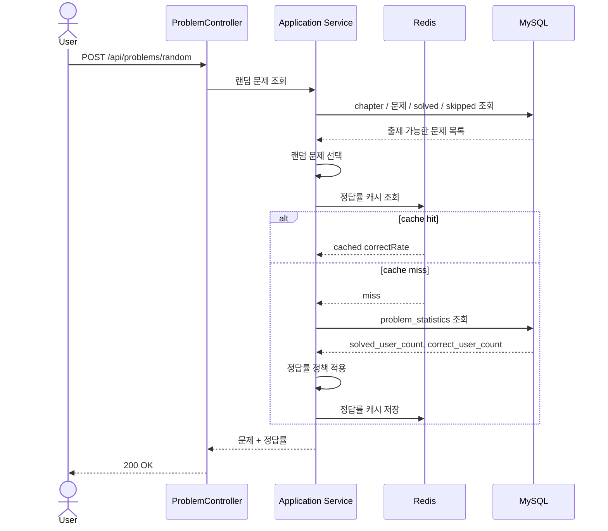
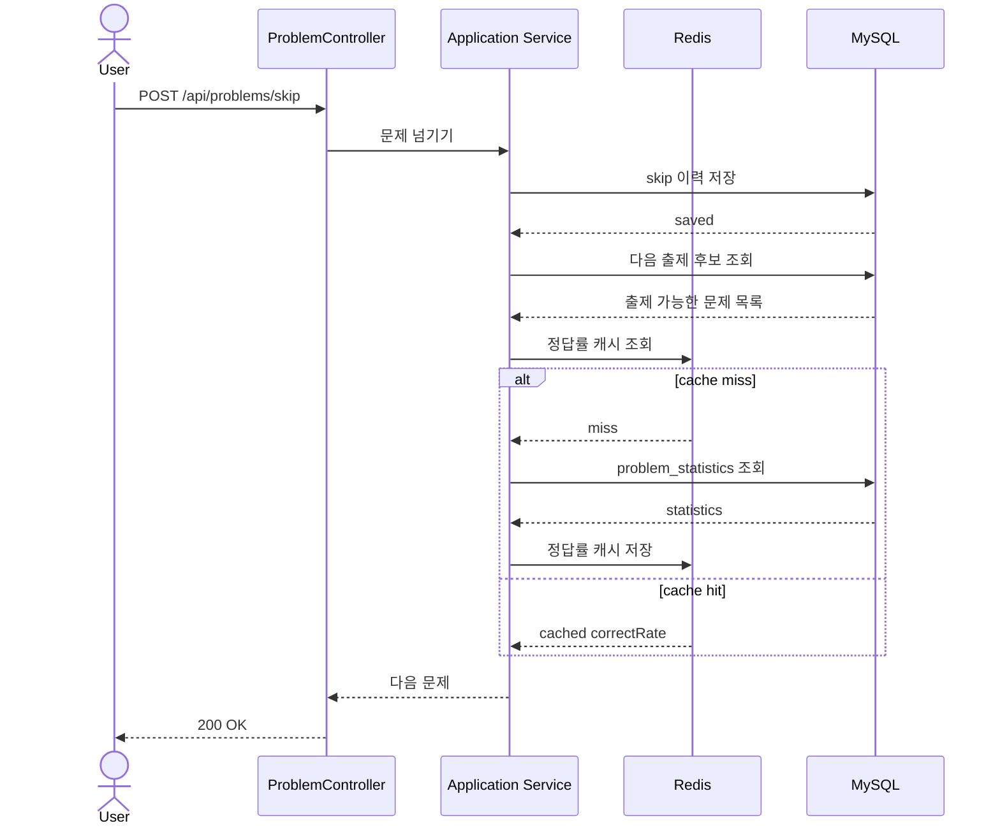
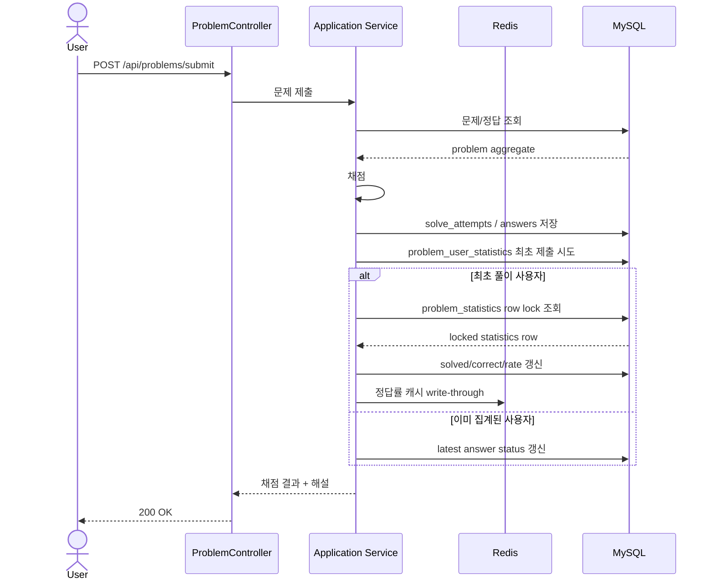
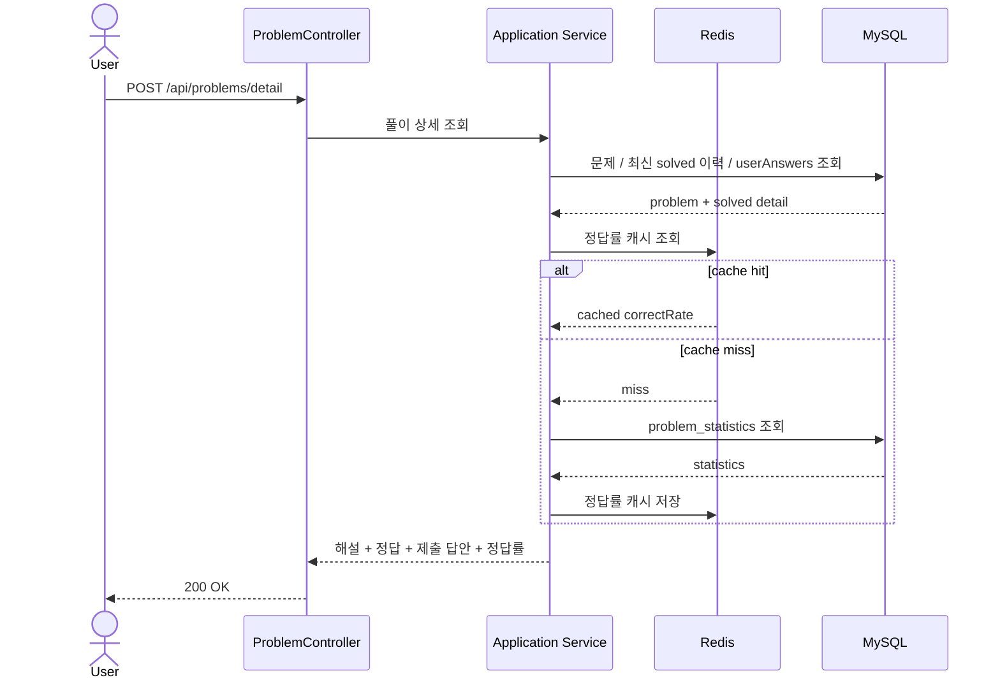

# 시퀀스 다이어그램

## 1. 랜덤 문제 조회

```mermaid
sequenceDiagram
    actor User
    participant API as ProblemController
    participant App as Application Service
    participant Redis as Redis
    participant MySQL as MySQL

    User->>API: POST /api/problems/random
    API->>App: 랜덤 문제 조회
    App->>MySQL: chapter / 문제 / solved / skipped 조회
    MySQL-->>App: 출제 가능한 문제 목록
    App->>App: 랜덤 문제 선택
    App->>Redis: 정답률 캐시 조회
    alt cache hit
        Redis-->>App: cached correctRate
    else cache miss
        Redis-->>App: miss
        App->>MySQL: problem_statistics 조회
        MySQL-->>App: solved_user_count, correct_user_count
        App->>App: 정답률 정책 적용
        App->>Redis: 정답률 캐시 저장
    end
    App-->>API: 문제 + 정답률
    API-->>User: 200 OK
```

## 2. 문제 넘기기

```mermaid
sequenceDiagram
    actor User
    participant API as ProblemController
    participant App as Application Service
    participant Redis as Redis
    participant MySQL as MySQL

    User->>API: POST /api/problems/skip
    API->>App: 문제 넘기기
    App->>MySQL: skip 이력 저장
    MySQL-->>App: saved
    App->>MySQL: 다음 출제 후보 조회
    MySQL-->>App: 출제 가능한 문제 목록
    App->>Redis: 정답률 캐시 조회
    alt cache miss
        Redis-->>App: miss
        App->>MySQL: problem_statistics 조회
        MySQL-->>App: statistics
        App->>Redis: 정답률 캐시 저장
    else cache hit
        Redis-->>App: cached correctRate
    end
    App-->>API: 다음 문제
    API-->>User: 200 OK
```

## 3. 문제 제출

```mermaid
sequenceDiagram
    actor User
    participant API as ProblemController
    participant App as Application Service
    participant Redis as Redis
    participant MySQL as MySQL

    User->>API: POST /api/problems/submit
    API->>App: 문제 제출
    App->>MySQL: 문제/정답 조회
    MySQL-->>App: problem aggregate
    App->>App: 채점
    App->>MySQL: solve_attempts / answers 저장
    App->>MySQL: problem_user_statistics 최초 제출 시도
    alt 최초 풀이 사용자
        App->>MySQL: problem_statistics row lock 조회
        MySQL-->>App: locked statistics row
        App->>MySQL: solved/correct/rate 갱신
        App->>Redis: 정답률 캐시 write-through
    else 이미 집계된 사용자
        App->>MySQL: latest answer status 갱신
    end
    App-->>API: 채점 결과 + 해설
    API-->>User: 200 OK
```

## 4. 풀었던 문제 상세 조회

```mermaid
sequenceDiagram
    actor User
    participant API as ProblemController
    participant App as Application Service
    participant Redis as Redis
    participant MySQL as MySQL

    User->>API: POST /api/problems/detail
    API->>App: 풀이 상세 조회
    App->>MySQL: 문제 / 최신 solved 이력 / userAnswers 조회
    MySQL-->>App: problem + solved detail
    App->>Redis: 정답률 캐시 조회
    alt cache hit
        Redis-->>App: cached correctRate
    else cache miss
        Redis-->>App: miss
        App->>MySQL: problem_statistics 조회
        MySQL-->>App: statistics
        App->>Redis: 정답률 캐시 저장
    end
    App-->>API: 해설 + 정답 + 제출 답안 + 정답률
    API-->>User: 200 OK
```
