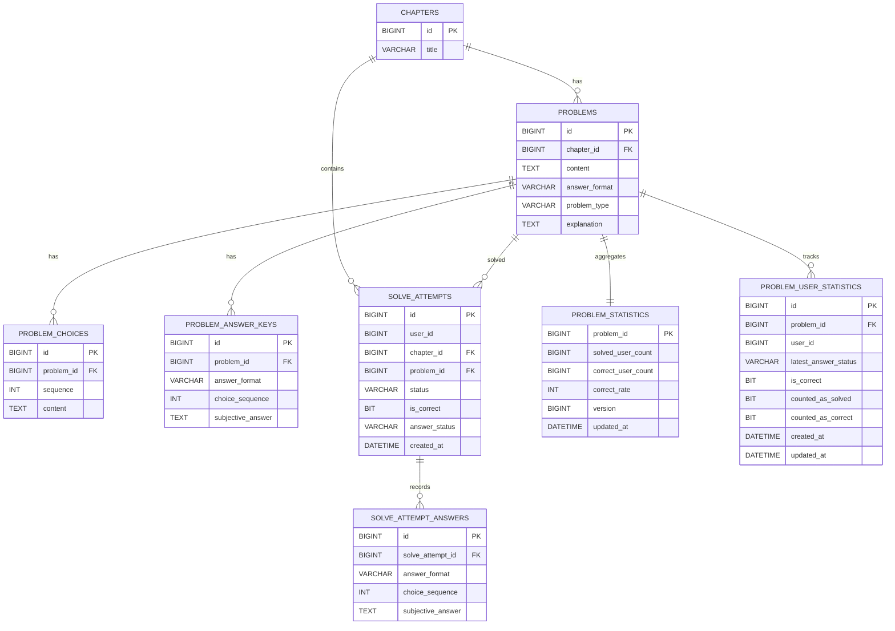

# ERD / JPA 설계

## ERD

## JPA 설계 관점

현재 JPA entity는 객체 연관관계를 최소화하고 FK id 기반으로 설계했습니다.

- `ProblemJpaEntity`는 `ChapterJpaEntity`를 직접 참조하지 않고 `chapterId`만 가집니다.
- `ProblemChoiceJpaEntity`도 `ProblemJpaEntity` 객체를 잡지 않고 `problemId`만 가집니다.

선택 이유:

- JPA 프록시와 지연 로딩 의존 최소화
- aggregate 경계 명확화
- 조회 쿼리 의도를 더 명시적으로 표현
- `quiz-domain`과 `quiz-infrastructure` 분리 유지

## JPA Entity 생성 방식

현재 JPA Entity는 `builder` 대신 `create()` 또는 의미가 드러나는 정적 팩토리 메서드를 사용했습니다.

예:

- `SolveAttemptJpaEntity.create(...)`
- `SolveAttemptAnswerJpaEntity.objective(...)`
- `SolveAttemptAnswerJpaEntity.subjective(...)`

이유:

- JPA Entity는 저장 모델이므로 허용되는 생성 형태를 제한하는 편이 더 안전합니다.
- 필수값이 빠진 partially initialized object를 줄일 수 있습니다.
- `builder`보다 `create()`가 어떤 row를 저장하는가를 더 직접적으로 보여줍니다.
- domain model과 JPA model의 역할 차이를 코드 스타일에서도 유지할 수 있습니다.

## ID 생성 전략

- `Chapter`, `Problem`처럼 요구사항과 시드 데이터에서 직접 식별되는 개체는 assigned id를 사용합니다.
- `ProblemChoice`, `ProblemAnswerKey`, `SolveAttempt`, `SolveAttemptAnswer`처럼 내부 row 식별이 목적이면 `@GeneratedValue`를 사용합니다.
- `ProblemStatistics`처럼 특정 문제의 스냅샷 row는 별도 surrogate key 대신 `problem_id` 자체를 PK로 사용합니다.

## 주요 인덱스 설계

정답률 처리와 조회 성능에서 실제로 중요한 테이블은 `solve_attempts`, `problem_statistics`, `problem_user_statistics`, `problems`입니다.

복합 인덱스를 설계할 때는 아래 순서를 기준으로 판단했습니다.

- **leftmost prefix rule**
  - 복합 인덱스는 왼쪽부터 연속으로 사용될 때 가장 잘 활용됩니다.
  - 예를 들어 `(user_id, problem_id, status, id)` 인덱스는
    - `user_id`
    - `user_id, problem_id`
    - `user_id, problem_id, status`
    까지는 효율적으로 탈 수 있지만, `problem_id, status`만으로는 같은 효과를 기대하기 어렵습니다.
- **`where` 절의 `=` 조건 컬럼 우선**
  - 동등 비교 컬럼을 앞에 두어 탐색 범위를 먼저 최대한 줄입니다.
- **그 다음 선택도가 좋은 컬럼**
  - 같은 `user_id` 아래에서도 `problem_id`처럼 더 잘 분산되는 컬럼을 앞쪽에 두는 것이 유리합니다.
- **그 다음 범위 조건 / 정렬 컬럼**
  - 마지막에는 `id desc`, `created_at desc`처럼 최신 1건 조회를 돕는 정렬/범위 컬럼을 둡니다.

현재 프로젝트에서는 이 기준으로 `solve_attempts`의 상세 조회 경로에 맞춰
`(user_id, problem_id, status, id)` 복합 인덱스를 추가했습니다.

## 테이블별 주요 인덱스

| 테이블 | 주요 인덱스 | 사용 쿼리 | 목적 | 보강 후보 |
|---|---|---|---|---|
| `solve_attempts` | `idx_solve_attempts_user_chapter (user_id, chapter_id)` | 사용자-단원 기준 풀이 이력 조회 | 특정 사용자/단원 범위의 이력 접근 | `status`까지 함께 타는 조회는 아래 복합 인덱스 우선 |
| `solve_attempts` | `idx_solve_attempts_user_chapter_status (user_id, chapter_id, status)` | `findSolvedProblemIds(userId, chapterId)` | 랜덤 문제 조회 시 이미 푼 문제 목록 계산 | 현재 랜덤 조회는 메모리 필터링 기반이라 장기적으로는 문제 후보 조회 쿼리 자체 최적화 여지 |
| `solve_attempts` | `idx_solve_attempts_problem (problem_id)` | `findCorrectRateSummaryByProblemId(problemId)` | 문제별 풀이 이력 집계 접근 | 현재는 `problem_statistics` 스냅샷을 주로 사용하므로 보조 성격 |
| `solve_attempts` | `idx_solve_attempts_user_problem_status_id (user_id, problem_id, status, id)` | `findTopByUserIdAndProblemIdAndStatusOrderByIdDesc(...)` | 상세 조회에서 특정 사용자의 특정 문제 최신 풀이 이력 1건 조회 | 이번에 추가 |
| `problem_statistics` | `PRIMARY KEY (problem_id)` | `findByProblemIdForUpdate(problemId)` | 정답률 스냅샷 단건 조회 및 row lock | 인덱스보다는 같은 `problemId` submit 집중 시 row lock 경쟁이 핵심 |
| `problem_user_statistics` | `UNIQUE (problem_id, user_id)` | `insertIgnoreFirstSolved(...)`, `findByProblemIdAndUserId(...)` | `distinct user` 기준 최초 제출 판정, 중복 집계 방지 | 현재 구조에서 핵심 정합성 인덱스 |
| `problems` | `PRIMARY KEY (id)` | 문제 단건 조회, 제출 대상 문제 조회 | 기본 문제 식별 | `findAllByChapterIdOrderByIdAsc(chapterId)` 기준으로 `(chapter_id, id)` 명시 인덱스는 추가 검토 가능 |

## 인덱스 관점에서 본 현재 구조

- 랜덤 문제 조회:
  - `solve_attempts(user_id, chapter_id, status)`로 이미 푼 문제 목록을 빠르게 구합니다.
  - 다만 현재는 `problems`를 chapter 기준으로 읽어온 뒤 메모리에서 제외 규칙을 적용하므로, 장기적으로는 문제 후보 조회를 DB 레벨에서 더 줄일 수 있습니다.
- 문제 상세 조회:
  - `solve_attempts(user_id, problem_id, status, id)` 인덱스로 최신 `SOLVED` 이력 1건 조회를 빠르게 가져오도록 보강했습니다.
- 정답률 갱신:
  - `problem_user_statistics(problem_id, user_id)` 유니크 인덱스로 중복 집계를 막고,
  - `problem_statistics(problem_id PK)`로 통계 row를 단건 잠금/갱신합니다.

즉 현재 인덱스 설계는
- 조회 경로에서는 사용자별/문제별 최신 이력 접근
- 집계 경로에서는 `distinct user` 보장과 문제별 스냅샷 갱신
에 초점을 두고 있습니다.
