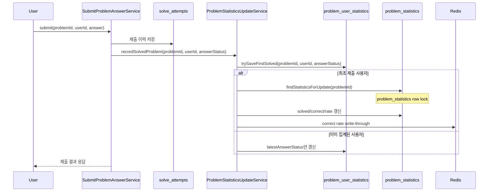
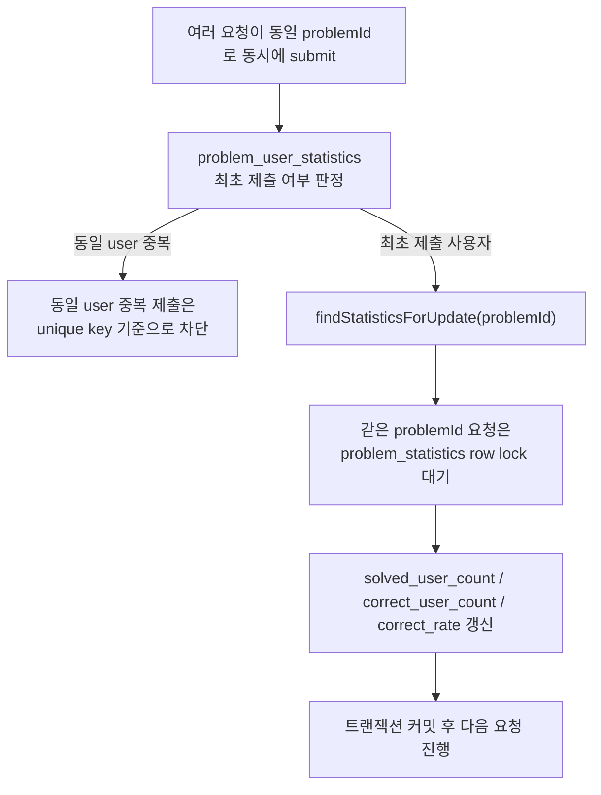

# 정답률 계산과 경쟁 상태 분석

## 배경

정답률 계산은 과제의 핵심 로직입니다. 조회 시마다 `solve_attempts`를 직접 집계하면 정답률 계산이 SQL에 묻히고 읽기 비용도 커진다고 판단했습니다.

현재 구현은:

- 제출 시 `problem_user_statistics`, `problem_statistics` 갱신
- 조회 시 Redis 캐시 우선
- cache miss 시 `problem_statistics` 조회

구조를 사용합니다.

## 검토한 방향

1. DB 집계 쿼리
- 가장 먼저 떠올린 방법은 조회 시마다 `solve_attempts`를 직접 집계하는 방식이었습니다.
- 장점:
  - 별도 통계 테이블 없이도 구현 가능
  - 데이터 정합성을 설명하기 쉽고 모델이 단순합니다.
- 단점:
  - 정답률 조회가 잦아질수록 집계 SQL 비용이 그대로 읽기 경로에 남습니다.
  - `distinct user` 기준 정답률, 부분 정답 정책, 동일 사용자 중복 제출 제외 같은 규칙이 SQL 안으로 깊게 들어가 가독성이 떨어집니다.
  - random/detail 조회마다 집계가 수행되면 읽기 API 성능이 쉽게 흔들릴 수 있습니다.
- 따라서 "구현은 쉽지만 조회 성능과 설명 가능성이 함께 나빠질 수 있다"는 이유로 최종 선택하지 않았습니다.

2. DB + Redis 읽기
- 현재 채택
- MySQL이 기준 저장소이고, Redis는 조회 캐시 역할을 맡는 구조입니다.
- 선택 이유:
  - 정합성은 DB가 책임지고, 읽기 성능은 Redis가 담당하도록 역할을 분리할 수 있습니다.
  - `problem_statistics`를 스냅샷 테이블로 두면 조회 시 복잡한 집계를 반복하지 않아도 됩니다.
  - Redis 장애가 나도 DB fallback으로 기능을 유지할 수 있어 설명과 운영 모두 무리가 적습니다.
- trade-off:
  - submit 시 통계 테이블을 함께 갱신해야 하므로 쓰기 경로는 단순하지 않습니다.
  - 같은 `problemId` submit이 몰리면 `problem_statistics` row lock 경합이 생길 수 있습니다.
- 과제 범위에서는 "정합성, 성능, 구현 복잡도"의 균형이 좋다고 판단해 이 방향을 채택했습니다.

3. 비동기 + Redis 활용
- submit 요청에서 통계 갱신을 분리하면 응답시간을 줄일 수 있으므로 자연스럽게 검토한 방향입니다.
- 기대 효과:
  - 현재 submit 경로의 병목인 통계 갱신을 사용자 요청이 응답을 기다리는 동기 처리 구간에서 빼낼 수 있습니다.
    - 왜냐하면 문제 제출 로직과 통계 갱신 로직은 서로 의존성이 없다고 판단했기 때문입니다.
  - hot problem submit 상황에서 응답속도를 더 안정적으로 만들 가능성이 있습니다.
- 고민한 지점:
  - 정답률이 즉시 반영되지 않는 최종적 일관성 모델을 받아들여야 합니다.
  - 단순히 Redis write-through만 비동기로 빼는 것으로는 핵심 병목이 충분히 줄지 않을 수 있습니다.
- 따라서 방향성 자체는 유효하지만, 현재 과제 범위에서는 "다음 단계 확장안"으로 두었습니다.

4. 백그라운드 집계 배치
- 정답률 도메인상 실시간성이 아주 중요하지 않다고 판단하여, submit 경로 밖에서 주기적으로 집계하거나 Redis를 다시 채우는 구조도 검토했습니다.
- 장점:
  - 설명이 단순하고 운영 제어가 쉽습니다.
  - Redis 유실, warm-up, 장기 재동기화에 적합합니다.
- 한계:
  - submit 직후 최신 정답률이 바로 반영되지 않을 수 있습니다.
  - 현재 submit 경로의 동기 통계 갱신을 그대로 두면, 배치만 추가해서는 병목이 크게 줄지 않습니다.
- 그래서 현재 배치는 "submit 대체 집계"가 아니라 "Redis 재동기화/복구용 보조 배치"로만 두었습니다.

5. Kafka 기반 비동기 집계
- 가장 확장성이 큰 방향은 이벤트 기반 비동기 집계입니다. problem_id 를 파티션 key 로 하여 진행을 고려했습니다.
- 장점:
  - submit과 통계 집계를 완전히 분리할 수 있습니다.
  - 트래픽이 더 커져도 확장 전략을 설명하기 좋습니다.
- 단점:
  - 메시지 브로커 운영, consumer 재처리, 순서 보장, 장애 대응까지 함께 설계해야 합니다.
  - 현재 과제의 구현 범위와 검증 범위를 넘어서는 복잡도가 생깁니다.
- 따라서 보고서에서는 장기 확장 방향으로만 언급하고, 현재 구현 대상에서는 제외했습니다.

## 현재 구조

- `solve_attempts`
  - 제출 이력 저장
- `problem_user_statistics`
  - `(problem_id, user_id)` 기준 최초 제출 여부 판정
- `problem_statistics`
  - `problem_id` 기준 정답률 스냅샷
- Redis
  - `problem:correct-rate:{problemId}` 캐시

## submit 정답률 갱신 흐름

## 현재 경쟁 상태가 발생하는 지점

현재 경쟁 상태는 두 단계로 나뉩니다.

## same problem submit contention point

1. `problem_user_statistics`
- 같은 `(problemId, userId)`로 중복 제출이 동시에 들어올 수 있으므로,
  unique key 기준으로 최초 제출 여부를 판정합니다.
- 이 단계는 동일 사용자의 중복 집계를 막기 위한 경쟁 제어 지점입니다.

2. `problem_statistics`
- 같은 `problemId`에 대해 여러 사용자의 제출이 동시에 몰릴 수 있으므로,
  `findStatisticsForUpdate(problemId)`로 `problem_statistics` row를 잠그고
  `solved_user_count`, `correct_user_count`, `correct_rate`를 갱신합니다.
- 현재 구조에서 실제 병목이 가장 잘 드러나는 지점은 이 row lock 획득 구간입니다.

즉 현재 경쟁 상태는
- `(problemId, userId)` 기준 중복 집계 방지
- `problemId` 기준 통계 row 갱신 직렬화
두 형태로 나뉘어 발생합니다.

## Atomic 타입을 사용하지 않은 이유

`ProblemStatistics.applyFirstSolved()` 내부에서는 `solvedUserCount += 1`, `correctUserCount += 1`를 사용합니다.
여기서 `AtomicInteger`/`AtomicLong`를 쓰는 방향은 적절하지 않다고 판단했습니다.

이유:

- 현재 경쟁 상태는 JVM 메모리 안의 공유 변수 경쟁이 아니라 DB row 갱신 경쟁입니다.
- 정합성은 Java atomic 타입이 아니라 `problem_statistics` row lock과 트랜잭션이 보장합니다.
- `AtomicInteger`는 단일 JVM 메모리 객체 경쟁에는 유효하지만, DB 기반 경쟁이나 다중 인스턴스 환경에는 충분하지 않습니다.

즉 여기서 중요한 것은 원자 타입이 아니라:

- unique key
- DB row lock
- 트랜잭션
- 이후 비동기/Redis 집계 전환 가능성

입니다.

## 동시성 검증

현재 구조가 실제로 정합성을 지키는지 아래 시나리오로 검증했습니다.

1. 동일한 문제에 대해 서로 다른 100명의 사용자가 동시에 제출
2. 동일한 문제에 대해 동일한 사용자가 동시에 여러 번 제출

이 테스트를 통해:

- hot problem 동시 제출
- distinct user 기준 집계

라는 두 가지 핵심 불변식이 깨지지 않는지를 확인했습니다.
