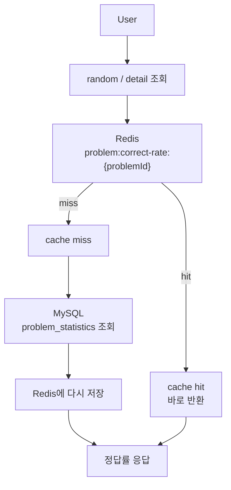
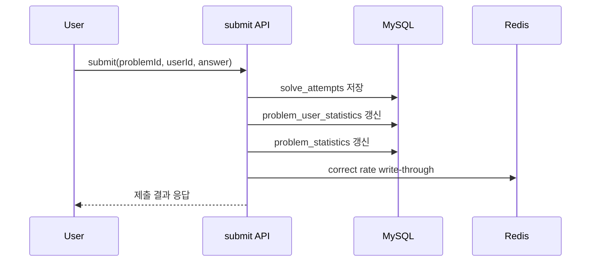
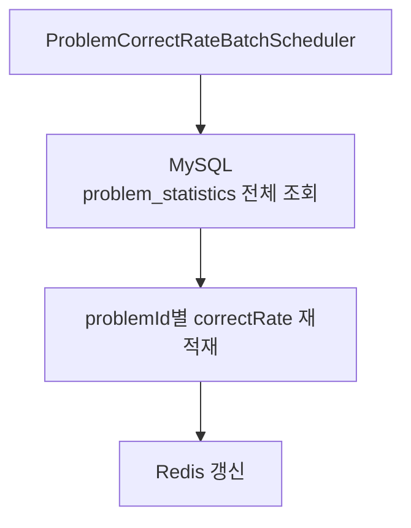

# 캐시 전략과 배치 재동기화

## 현재 캐시 전략

현재 정답률 조회는 Redis를 사용하는 `cache-aside + write-through` 방식으로 구성했습니다.

### 조회

- 먼저 Redis에서 `problem:correct-rate:{problemId}` 키 조회
- cache hit면 바로 반환
- cache miss면 `problem_statistics`를 읽고 `ProblemCorrectRatePolicy`를 적용한 뒤 Redis에 다시 저장

### 제출

- `problem_statistics`, `problem_user_statistics`를 갱신한 뒤 Redis에도 같은 값을 즉시 반영

### null 정답률

- 30명 미만 풀이 문제는 `NULL` sentinel 값으로 저장해 cache penetration을 줄였습니다.

### 장애 대응

- Redis 예외가 발생해도 DB fallback으로 동작하도록 했습니다.

## 이 전략을 선택한 이유

- 정답률은 조회 빈도가 높고 계산 규칙이 명확해 캐시 효율이 높습니다.
- submit 시 DB 기준 정합성을 유지하면서도 조회는 Redis에서 빠르게 처리할 수 있습니다.
- 과제 범위에서 설명 가능성과 성능 개선 가능성의 균형이 좋습니다.

## 배치 재동기화

현재 배치는 submit 경로를 대체하는 집계 방식이 아니라,
Redis 캐시 재동기화와 복구를 위한 보조 배치입니다.

동작:

- `ProblemCorrectRateBatchScheduler` 스케줄러가 주기적으로 `problem_statistics` 전체 조회
- 각 `problemId`의 `correctRate`를 Redis에 다시 반영

목적:

- Redis 장애 후 캐시 복구
- cache miss가 많아진 상황에서 warm-up
- MySQL 기준 값과 Redis 값의 장기 재동기화

## 한계

- 현재 배치는 Redis 재동기화/복구에는 유용하지만 submit 경로의 병목 자체를 줄여주지는 않습니다.
- submit 성능 자체를 줄이려면 결국 통계 갱신을 request path 밖으로 옮기는 비동기 구조가 필요합니다.

## 향후 확장 방향

- 정답률 갱신 비동기화
- Redis write-through에서 event-driven 집계로 확장
- 배치 재동기화에서 변경분만 갱신하는 증분 방식으로 발전
